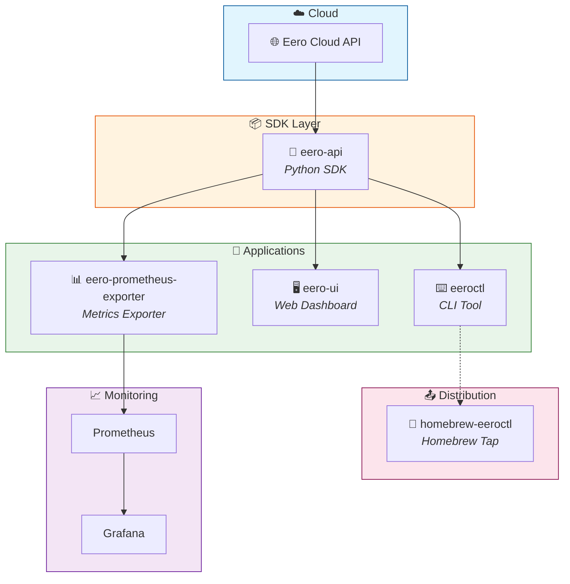

# 🌐 eero-ecosystem

> Unified workspace for the eero network management tools ecosystem

## 📦 Projects

| Project | Description | Links |
|---------|-------------|-------|
| 🐍 **eero-api** | Python SDK for the Eero API | [](https://github.com/fulviofreitas/eero-api) [](https://pypi.org/project/eero-api/) |
| ⌨️ **eeroctl** | Command-line interface for managing Eero networks | [](https://github.com/fulviofreitas/eeroctl) |
| 🖥️ **eero-ui** | Web-based dashboard for Eero network management | [](https://github.com/fulviofreitas/eero-ui) |
| 📊 **eero-prometheus-exporter** | Prometheus metrics exporter for Eero networks | [](https://github.com/fulviofreitas/eero-prometheus-exporter) |
| 🍺 **homebrew-eeroctl** | Homebrew tap for eeroctl installation | [](https://github.com/fulviofreitas/homebrew-eeroctl) |

## 🏗️ Architecture



## ⚡ Quick Start

### Install eeroctl via Homebrew

```bash
brew tap fulviofreitas/eeroctl
brew install eeroctl
```

### Install eero-api via pip

```bash
pip install eero-api
```

## 📄 License

MIT License - see individual project repositories for details.
