# 🌐 eero-ecosystem

> Unified workspace for the eero network management tools ecosystem

## 📦 Projects

| Project | Description | Links |
|---------|-------------|-------|
| 🐍 **eero-api** | Python SDK for the Eero API |   |
| ⌨️ **eeroctl** | Command-line interface for managing Eero networks |    |
| 🖥️ **eero-ui** | Web-based dashboard for Eero network management |   |
| 📊 **eero-prometheus-exporter** | Prometheus metrics exporter for Eero networks |    |

## 🏗️ Architecture

```mermaid
flowchart LR
    subgraph Cloud["☁️ Cloud"]
        API["🌐 Eero Cloud API"]
    end

    subgraph SDK["📦 SDK"]
        EERO_API["🐍 eero-api"]
    end

    subgraph Apps["🚀 Applications"]
        direction TB
        CLI["⌨️ eeroctl"]
        EXPORTER["📊 exporter"]
        UI["🖥️ eero-ui"]
    end

    subgraph Dist["📤 Distribution"]
        HOMEBREW["🍺 homebrew"]
    end

    subgraph Mon["📈 Monitoring"]
        direction TB
        PROMETHEUS["Prometheus"]
        GRAFANA["Grafana"]
    end

    API --> EERO_API
    EERO_API --> CLI
    EERO_API --> EXPORTER
    EERO_API --> UI
    CLI -.-> HOMEBREW
    EXPORTER --> PROMETHEUS
    PROMETHEUS --> GRAFANA
    PROMETHEUS -.-> UI

    style Cloud fill:#e1f5fe,stroke:#01579b
    style SDK fill:#fff3e0,stroke:#e65100
    style Apps fill:#e8f5e9,stroke:#2e7d32
    style Dist fill:#fce4ec,stroke:#880e4f
    style Mon fill:#f3e5f5,stroke:#6a1b9a
```

## 📄 License

MIT License - see individual project repositories for details.
